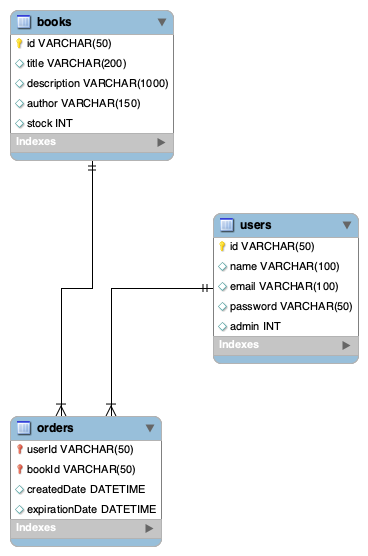

# Database Structure
This document serves as detailed description of the MySQL database structure used in the application.

## Tables
The database consists of three tables.
- `users` - this table represents individual users (admins, students)
- `books` - this table represents individual books and their stock
- `orders` - this table represents students' book orders

## EER Diagram
Below is the EER diagram of the database.

The primary key of the `orders` table is the combination of two foreign keys and one internal value.
- `userId` - from `users.id`
- `bookId` - from `books.id`
- `createdDate`

Note that the `userId` and `bookId` cannot generate a primary key alone, since one user can order the same book more than once, but not at the same time.
The `createdDate` attribute ensures that the primary key is truly unique and multiple same orders are accepted.
However, this prohibits the user to order two same books at the same time.

by [Tomas Boda](https://github.com/TomasBoda)