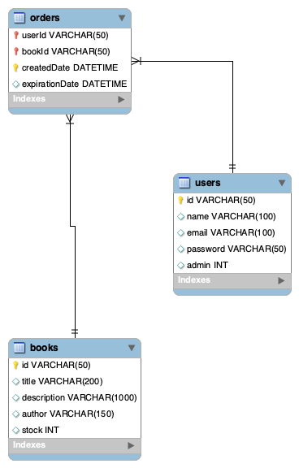

# Database Structure
This document serves as detailed description of the MySQL database structure used in the application.

## Tables
The database consists of three tables.
- `users` - this table represents individual users (admins, students)
- `books` - this table represents individual books and their stock
- `orders` - this table represents students' book orders

## EER Diagram
Below is the EER diagram of the database.



The primary key of the `orders` table is the combination of two foreign keys and one internal value.
- `userId` - from `users.id`
- `bookId` - from `books.id`
- `createdDate`

Note that the `userId` and `bookId` cannot generate a primary key alone, since one user can order the same book more than once, but not at the same time.
The `createdDate` attribute ensures that the primary key is truly unique and multiple same orders are accepted.
However, this prohibits the user to order two same books at the same time.

## Database Generation Script
The following script creates the database for the Library Management System application.
```sql
SET @OLD_UNIQUE_CHECKS=@@UNIQUE_CHECKS, UNIQUE_CHECKS=0;
SET @OLD_FOREIGN_KEY_CHECKS=@@FOREIGN_KEY_CHECKS, FOREIGN_KEY_CHECKS=0;
SET @OLD_SQL_MODE=@@SQL_MODE, SQL_MODE='ONLY_FULL_GROUP_BY,STRICT_TRANS_TABLES,NO_ZERO_IN_DATE,NO_ZERO_DATE,ERROR_FOR_DIVISION_BY_ZERO,NO_ENGINE_SUBSTITUTION';

-- -----------------------------------------------------
-- Schema library
-- -----------------------------------------------------
CREATE SCHEMA IF NOT EXISTS `library` DEFAULT CHARACTER SET utf8mb4 COLLATE utf8mb4_0900_ai_ci ;
USE `library` ;

-- -----------------------------------------------------
-- Table `library`.`books`
-- -----------------------------------------------------
CREATE TABLE IF NOT EXISTS `library`.`books` (
  `id` VARCHAR(50) NOT NULL,
  `title` VARCHAR(200) NULL DEFAULT NULL,
  `description` VARCHAR(1000) NULL DEFAULT NULL,
  `author` VARCHAR(150) NULL DEFAULT NULL,
  `stock` INT NULL DEFAULT '0',
  PRIMARY KEY (`id`))
ENGINE = InnoDB
DEFAULT CHARACTER SET = utf8mb4
COLLATE = utf8mb4_0900_ai_ci;


-- -----------------------------------------------------
-- Table `library`.`users`
-- -----------------------------------------------------
CREATE TABLE IF NOT EXISTS `library`.`users` (
  `id` VARCHAR(50) NOT NULL,
  `name` VARCHAR(100) NULL DEFAULT NULL,
  `email` VARCHAR(100) NULL DEFAULT NULL,
  `password` VARCHAR(50) NULL DEFAULT NULL,
  `admin` INT NULL DEFAULT NULL,
  PRIMARY KEY (`id`))
ENGINE = InnoDB
DEFAULT CHARACTER SET = utf8mb4
COLLATE = utf8mb4_0900_ai_ci;


-- -----------------------------------------------------
-- Table `library`.`orders`
-- -----------------------------------------------------
CREATE TABLE IF NOT EXISTS `library`.`orders` (
  `userId` VARCHAR(50) NOT NULL,
  `bookId` VARCHAR(50) NOT NULL,
  `createdDate` DATETIME NOT NULL,
  `expirationDate` DATETIME NULL DEFAULT NULL,
  PRIMARY KEY (`userId`, `bookId`, `createdDate`),
  INDEX `orderId_idx` (`bookId` ASC) VISIBLE,
  CONSTRAINT `bookId`
    FOREIGN KEY (`bookId`)
    REFERENCES `library`.`books` (`id`),
  CONSTRAINT `userId`
    FOREIGN KEY (`userId`)
    REFERENCES `library`.`users` (`id`))
ENGINE = InnoDB
DEFAULT CHARACTER SET = utf8mb4
COLLATE = utf8mb4_0900_ai_ci;


SET SQL_MODE=@OLD_SQL_MODE;
SET FOREIGN_KEY_CHECKS=@OLD_FOREIGN_KEY_CHECKS;
SET UNIQUE_CHECKS=@OLD_UNIQUE_CHECKS;
```

by [Tomas Boda](https://github.com/TomasBoda)